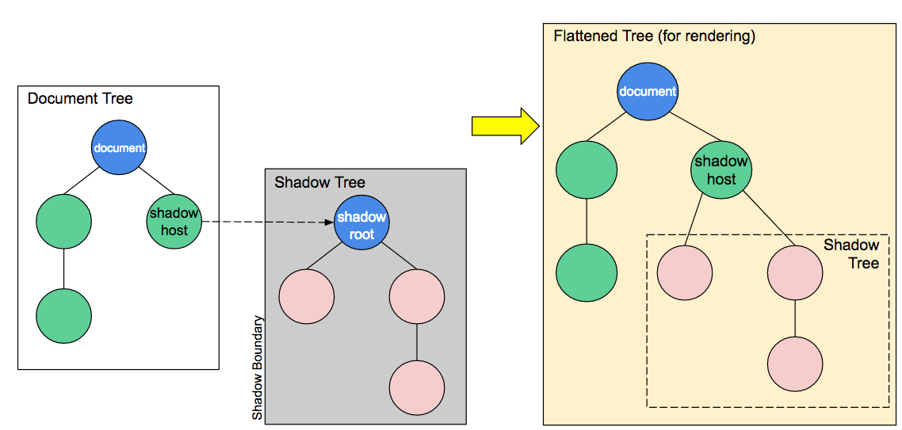
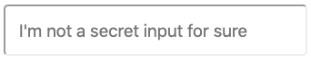

# Web Components

Iniciaremos con la creación de la base para nuestro proyecto:

```
	WebComponents/
		components/ ---> Carpeta de componentes
		src/		---> Lógica de la aplicación
		index.html  ---> Vista principal
```

podemos usar el siguiente script:

```bash
	mkdir -p WebComponents/components WebComponents/src
	cd WebComponents
	touch index.html
```

## Creación de un componente

Crearemos un componente para un elemento de tipo Input especial que oculte el valor original escrito por el usuario mientras escribe un mensaje predeterminado para despistar a los espías.

Ejemplo:

```
	Input del usuario: Estamos [7 caracteres]
	Texto visible: Hola, n [7 caracteres]
```

```
	Input del usuario: Estamos bajo ataque [19 caracteres]
	Texto visible: Hola, ninguna noved [19 caracteres]
```

### Paso 1. Creación del proyecto componente

```bash
	#Asumiendo que el usuario está en WebComponents
	mkdir -p components/SecretInput/src
	cd components/SecretInput
	touch secret-input.html src/main.js src/SecretInput.js
	
```

### Paso 2. Definición de la vista principal del componente (secret-input.html)

Usando el template base de html5 para la vista principal e importamos los archivos de lógica principal (main) y la clase del componente a definir:

```html
<!DOCTYPE html>
<html lang="es">
<head>
    <meta charset="UTF-8">
    <meta name="viewport" content="width=device-width, initial-scale=1.0">
    <meta http-equiv="X-UA-Compatible" content="ie=edge">
    <title>Secret Input component</title>
    <script src="src/SecretInput.js"></script>
</head>
<body>
    <script src="src/main.js"></script>
</body>
</html>
```

### Paso 3. Definimos el componente

Los componentes o custom tags son clases que extienden la clase ``HTMLElement``

```js
	//SecretInput.js
	class SecretInput extends HTMLElement {
		
		constructor(){
			super();//Constructor del padre
			this._shadow = this.attachShadow({mode: 'open'});
		}
		
		get shadow() {
        	return this._shadow;
	    }
	
	    set shadow(val) {
	        this._shadow = val;
	    }
		
	}
```

El primer atributo a destacar de nuestros componentes será ``shadow`` que en este caso inicia con ``_``debido a que queremos que sea un atributo privado. La relevancia de este atributo es que nos permite tener la capacidad de **encapsular** nuestro componente separando su estructura, estilo y comportamiento ocultos, evitando también conflictos con demás elementos de la aplicación.



* **Shadow host:** El nodo regular del DOM al que es atado el shadow DOM.
* **Shadow tree:** El arbol DOM dentro del shadow DOM.
* **Shadow boundary:** El punto en el que el shadow DOM termina y el DOM regular comienza.
* **Shadow root:** El nodo raiz del arbol Shadow.

Para más información del Shadow DOM [acá](https://developer.mozilla.org/es/docs/Web/Web_Components/Using_shadow_DOM)

### 4. Definir el render del componente, su función de renderización y adicionarlo al DOM

Los componentes cuentan con una parte lógica y una vista, dicha vista se renderizará al momento en que el componente sea integrado al DOM mediante el método que sobreeescribiremos llamada ``connectedCallback``:

```js
connectedCallback() {
        var template = `
            <style>
                .sinput {
                    padding: 15px;
                    font-size: 120%;
                    border-radius: 5px;
                    width: 300px;
                }
            </style>
            <input class="sinput" placeholder="I'm not a secret input for sure"/>
        `;

        this.shadow.innerHTML = template;
}

```

Según nuestro método ``connectedCallback`` la representación del componente será un input con algo de padding, una letra más grande de lo normal y bordes redondeados por ahora. 

Antes de proceder debemos conocer un poco más de la cronología del ``connectedCallback`` dentro de nuestro componente y aplicación. 

1. Este método se ejecuta una vez el elemento se ha integrado al DOM, lo que claramente implica que de alguna manera debemos presentarlo ante el DOM pues este es un custom element y es desconocido al iniciar la aplicación.
2. Hasta que la ejecución de este método no se lleve a cabo, no podremos acceder a la representación del componente ni sus atributos.
3. El método ``constructor()`` es llamado al crear una instancia del componente mientras que ``connectedCallback`` is llamado después de adicionar el componente al DOM.

Si quiere ver un ejemplo [acá](https://stackoverflow.com/questions/40492330/difference-between-constructor-and-connectedcallback-in-custom-elements-v1)

Con todo esto ahora sólo nos hace falta registrar nuestro componente para poder usarlo, lo haremos desde ``main.js``

```js
	window.customElements.define('secret-input', SecretInput);

```

### 5. Incluir el componente en la vista principal de la aplicación

Una vez nuestro componente en su versión más básica está listo no hace falta más que incluirle en la vista principal ``index.html``

```html
	<!DOCTYPE html>
<html lang="es">
<head>
    <meta charset="UTF-8">
    <meta name="viewport" content="width=device-width, initial-scale=1.0">
    <meta http-equiv="X-UA-Compatible" content="ie=edge">
    <title>Web Components</title>
    <link rel="import" href="./components/SecretInput/secret-input.html">
</head>
<body>
        <secret-input></secret-input>
</body>
</html>
```
Ahora podremos abrir la aplicación y nuestro componente se vería así:



**Nota:** Importar un elemento require de permisos CORS.

### 6. Adicionar atributos al componente

Al igual que las etiquetas comunes, los componentes pueden tener asociados atributos, los cuales serán observados mediante el registro de los mismos en el accesor ``observedAttributes`. Por ejemplo nuestro input secreto tendrá los atributos **masked** y **color**.

```js
	static get observedAttributes() {
        return ['masked', 'color'];
    }
```
Así mismo usaremos el método ``attributeChangedCallback`` para manejar el evento en que se cambie el valor de alguno de estros atributos:

```js
	/**
     * attributeChangedCallback
     * 
     * Se ejecuta cuando el valor de cualquier atributo declarado dentro del arreglo de los 
     * observedAttributes cambia.
     * 
     * @param {string} name nombre del atributo que cambia
     * @param {mixed} oldVal valor anterior del atributo
     * @param {mixed} newValue nuevo valor del atributo
     */
    attributeChangedCallback(name, oldVal, newValue) {
        this[`update${name.charAt(0).toUpperCase() + name.slice(1)}`](oldVal,newValue);
    }
    
```

En la implementación anterior realizamos una generalización del proceso definiendo que siempre para responder al cambio de un atributo se ejecutaría un método propio que inicie con ``update`` y con camelcase tenga el nombre del atributo, además dicho método recibirá el valor anterior del atributo y el nuevo por si es requerido para comparaciones. Siguiendo dicha lógica adicionaremos a nuestro componente los getters y setters de los nuevos atributos y también los métodos para respondera sus cambios:

```js
	...
	
	get masked() {
        return this._masked;
    }

    set masked(val) {
        this._masked = val;
    }
    
    get color() {
        return this._color;
    }

    set color(val) {
        this._color = val;
    }
    
    ...
    
    updateMasked(oldVal, newValue) {
        //Su lógica acá para mostrar o no el texto original
    }
    
    updateColor(oldVal, newValue) {
        var input = this.shadow.querySelector('.sinput');
        input.style.color = newValue;
    }
```

#### Listo, hemos terminado, el componente debería verse así:

```js
	//SecretInput.js
class SecretInput extends HTMLElement {

    constructor() {
        super();//Constructor del padre
        this._shadow = this.attachShadow({ mode: 'open' });
        this._masked = true;
        this._color = "#000";
    }

    get shadow() {
        return this._shadow;
    }

    set shadow(val) {
        this._shadow = val;
    }

    get masked() {
        return this._masked;
    }

    set masked(val) {
        this._masked = val;
    }
    
    get color() {
        return this._color;
    }

    set color(val) {
        this._color = val;
    }

    static get observedAttributes() {
        return ['masked', 'color'];
    }

    /**
     * attributeChangedCallback
     * 
     * Se ejecuta cuando el valor de cualquier atributo declarado dentro del arreglo de los 
     * observedAttributes cambia.
     * 
     * @param {string} name nombre del atributo que cambia
     * @param {mixed} oldVal valor anterior del atributo
     * @param {mixed} newValue nuevo valor del atributo
     */
    attributeChangedCallback(name, oldVal, newValue) {
        this[`update${name.charAt(0).toUpperCase() + name.slice(1)}`](oldVal,newValue);
    }
    

    updateMasked(oldVal, newValue) {
        //Su lógica acá para mostrar o no el texto original
    }
    
    updateColor(oldVal, newValue) {
        var input = this.shadow.querySelector('.sinput');
        input.style.color = newValue;
    }

    connectedCallback() {
        var template = `
            <style>
                .sinput {
                    padding: 15px;
                    font-size: 120%;
                    border-radius: 5px;
                    width: 300px;
                }
            </style>
            <input class="sinput" placeholder="I'm not a secret input for sure"/>
        `;

        this.shadow.innerHTML = template;
    }

}
```

Ahora es hora de darle la funcionalidad de enmascarar el texto con otro texto... buena suerte
